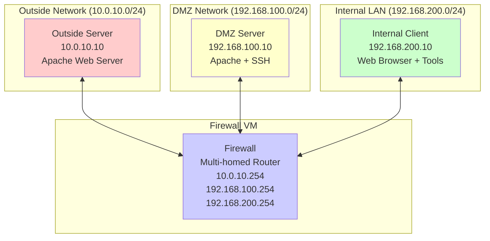
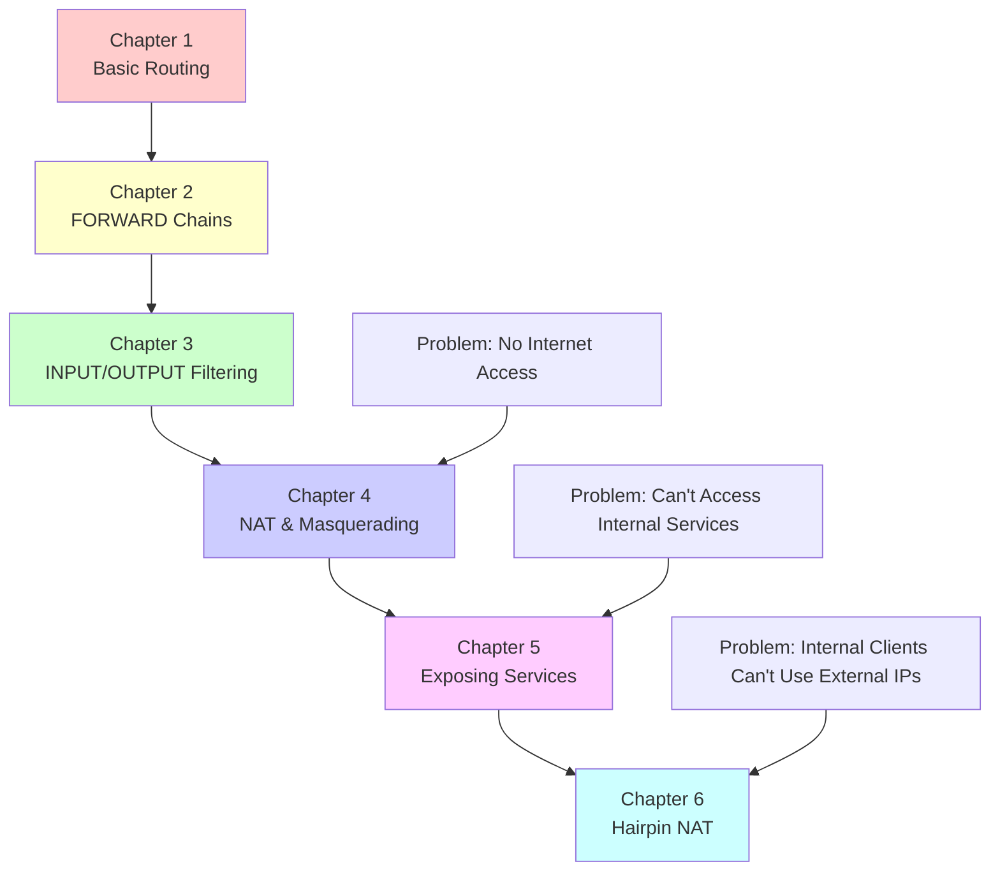

# IPTables Network Lab

This Vagrant-based lab environment provides a realistic network topology for learning Linux networking, iptables firewall rules, and network security concepts. The lab simulates a network with multiple segments and a central firewall.

## 🏗️ Network Architecture



## 🖥️ Virtual Machines

All machines have an interface on VirtualBox's NAT interface, so the provisioning scripts will work. For the client and dmz VMs, it will be overridden at provisioning time to set up correctly the lab scenario. 
**Note** Interfaces names may vary, so check everytime and don't trust that copying and pasting commands will work out of the box (it's a lab environment! 😊)

### Firewall VM (`firewall`)
- **Role**: Central router and firewall
- **Interfaces**:
  - `eth1`: 10.0.10.254/24 (Outside network)
  - `eth2`: 192.168.100.254/24 (DMZ network)
  - `eth3`: 192.168.200.254/24 (Internal LAN)
- **Resources**: 1GB RAM, 2 CPUs
- **Services**: iptables, IP forwarding enabled

### Outside Server (`outside-server`)
- **Role**: Simulates external internet services
- **IP**: 10.0.10.10/24
- **Services**: Apache web server (port 80)
- **Resources**: 1024MB RAM, 1 CPU
- **Gateway**: 10.0.10.254 (firewall)

### DMZ Server (`dmz-server`)
- **Role**: Publicly accessible services in demilitarized zone
- **IP**: 192.168.100.10/24
- **Services**: Apache web server (port 80), SSH (port 22)
- **Resources**: 1024MB RAM, 1 CPU
- **Gateway**: 192.168.100.254 (firewall)

### Internal Client (`internal-client`)
- **Role**: Internal network client/workstation
- **IP**: 192.168.200.10/24
- **Services**: Web browsers, network testing tools
- **Resources**: 1024MB RAM, 1 CPU
- **Gateway**: 192.168.200.254 (firewall)

## 🚀 Quick Start

### Prerequisites
- [VirtualBox](https://www.virtualbox.org/)
- [Vagrant](https://www.vagrantup.com/)

### Launch the Lab
```bash
# Start all VMs (firewall starts first, then others)
vagrant up

# Check status of all VMs
vagrant status

# SSH into specific VMs
vagrant ssh firewall
vagrant ssh dmz-server
vagrant ssh internal-client
vagrant ssh outside-server
```

### Test Basic Connectivity
```bash
# SSH into internal client and run connectivity test
vagrant ssh internal-client
/home/vagrant/test-connectivity.sh
```

## 🧪 Lab Exercises

### 1. Basic Network Exploration
```bash
# On firewall VM
vagrant ssh firewall
ip addr show                    # View all network interfaces
ip route show                   # View routing table
iptables -L -v -n              # View current firewall rules
```

### 2. Traffic Flow Analysis
```bash
# Monitor traffic on firewall
sudo tcpdump -i any icmp       # Monitor ping traffic
sudo tcpdump -i eth2 -n      # Monitor DMZ interface

# Test connectivity from internal client
vagrant ssh internal-client
ping 192.168.100.10             # Ping DMZ server
curl http://192.168.100.10      # Access DMZ web service
```

### 3. Firewall Rule Creation

#### Block Internal to Outside Access
```bash
# On firewall VM
sudo iptables -A FORWARD -s 192.168.200.0/24 -d 10.0.10.0/24 -j DROP
```

#### Allow Internal to DMZ on HTTP Only
```bash
# On firewall VM
sudo iptables -A FORWARD -s 192.168.200.0/24 -d 192.168.100.0/24 -p tcp --dport 80 -j ACCEPT
sudo iptables -A FORWARD -s 192.168.200.0/24 -d 192.168.100.0/24 -j DROP
```

#### Port Forwarding (DNAT) Example
```bash
# Forward external port 8080 to DMZ server port 80
sudo iptables -t nat -A PREROUTING -i enp0s8 -p tcp --dport 8080 -j DNAT --to-destination 192.168.100.10:80
```

### 4. Advanced Scenarios

#### DMZ to Internal Block
```bash
# Prevent DMZ from accessing internal network
sudo iptables -A FORWARD -s 192.168.100.0/24 -d 192.168.200.0/24 -j DROP
```

#### Logging Rules
```bash
# Log dropped packets
sudo iptables -A FORWARD -j LOG --log-prefix "FORWARD-DROP: "
sudo iptables -A INPUT -j LOG --log-prefix "INPUT-DROP: "

# View logs
sudo tail -f /var/log/kern.log | grep "FORWARD-DROP\|INPUT-DROP"
```

## 📚 Learning Objectives

After completing this lab, you will understand:

1. **Network Segmentation**: How to isolate different network zones
2. **Firewall Rules**: Creating and managing iptables rules
3. **NAT Configuration**: Setting up source and destination NAT
4. **Traffic Filtering**: Controlling traffic based on source, destination, and ports
5. **Default Policies**: Understanding ACCEPT vs DROP default policies
6. **Chain Traversal**: How packets traverse INPUT, FORWARD, and OUTPUT chains
7. **Logging**: Monitoring and troubleshooting network traffic

## 🛠️ Useful Commands

### Vagrant Commands
```bash
vagrant up                     # Start all VMs
vagrant halt                   # Stop all VMs
vagrant destroy                # Delete all VMs
vagrant reload firewall        # Restart specific VM
vagrant ssh firewall           # SSH into firewall
```

### IPTables Commands
```bash
# View rules
iptables -L -v -n              # List all rules with counters
iptables -t nat -L -v -n       # List NAT rules


# Clear rules
iptables -F                    # Flush all rules
iptables -t nat -F            # Flush NAT rules
iptables -X                   # Delete custom chains
```

### Network Troubleshooting
```bash
# Test connectivity
ping <ip>                     # ICMP test
telnet <ip> <port>           # TCP port test
nc -zv <ip> <port>           # Port scanner

# Monitor traffic
tcpdump -i <interface>        # Capture packets
ss -tuln                     # Show listening ports
netstat -rn                  # Show routing table
```

## 🔧 Troubleshooting

### Common Issues

1. **VMs don't start**: Check VirtualBox is installed and virtualization is enabled
2. **Network connectivity fails**: Verify IP forwarding is enabled on firewall
3. **SSH connection refused**: Check if SSH service is running on target VM
4. **Web services unreachable**: Verify Apache is running and firewall rules allow traffic

### Reset Lab Environment
```bash
# Destroy and recreate all VMs
vagrant destroy -f
vagrant up
```

## � Structured Learning Exercises

This lab includes a comprehensive series of hands-on exercises in the `exercises/` directory. Each chapter builds progressively from basic concepts to advanced networking scenarios:

### 🗺️ Learning Path



### 📖 Exercise Chapters

#### [Chapter 1: Basic Routing](exercises/1-basic-routing.md)
**Foundation concepts for network communication**
- Understanding routing tables and default gateways
- Testing connectivity between network segments  
- Identifying the return path problem that NAT solves
- **Learning Goal**: Why private networks can't communicate with external hosts

#### [Chapter 2: IPTables Forwarding Chains](exercises/2-iptables-forwarding.md)
**Controlling inter-network traffic flow**
- Understanding packet traversal through the FORWARD chain
- Creating rules to allow/deny traffic between network segments
- Implementing stateful connection tracking
- **Learning Goal**: Firewall as a network traffic controller

#### [Chapter 3: Input and Output Filtering](exercises/3-input-output-filtering.md) 
**Protecting the firewall host itself**
- Securing services running on the firewall
- Creating management access policies
- Implementing rate limiting and attack prevention  
- **Learning Goal**: Host-based vs network-based security

#### [Chapter 4: NAT and Masquerading](exercises/4-nat-masquerading.md)
**Enabling internet access for private networks**
- Understanding Source NAT (SNAT) and MASQUERADE
- Solving the return path routing problem from Chapter 1
- Implementing outbound internet access for internal networks
- **Learning Goal**: How NAT enables private networks to access the internet

#### [Chapter 5: Exposing DMZ Services](exercises/5-exposing-dmz-services.md)
**Publishing internal services to external networks**
- Understanding Destination NAT (DNAT) and port forwarding  
- Exposing web servers and SSH services securely
- Implementing service-specific access controls
- **Learning Goal**: Making internal services accessible from the internet

#### [Chapter 6: Hairpin NAT](exercises/6-hairpin-nat.md)
**Advanced NAT for internal access to published services**
- Solving the hairpin NAT problem for internal clients
- Implementing bidirectional NAT (DNAT + SNAT)
- Eliminating the need for split-brain DNS
- **Learning Goal**: Seamless service access regardless of client location

### 🎯 What You'll Learn

After completing all exercises, you will:
- ✅ **Understand Linux routing** and packet flow between networks
- ✅ **Master iptables chains** (INPUT, OUTPUT, FORWARD, PREROUTING, POSTROUTING)  
- ✅ **Configure network security policies** for different network segments
- ✅ **Implement NAT solutions** for both inbound and outbound traffic
- ✅ **Troubleshoot connectivity issues** using standard Linux tools
- ✅ **Design secure network architectures** with proper segmentation
- ✅ **Handle complex NAT scenarios** including hairpin NAT

### 🚀 Getting Started with Exercises

```bash
# Start the lab environment
vagrant up

# Begin with the exercise series
cd exercises/
cat README.md  # Full exercise index and instructions

# Follow the chapters in order
less 1-basic-routing.md
```

Each exercise includes step-by-step instructions, Mermaid diagrams, practical scenarios, and lab questions to test your understanding.

## �📖 Additional Resources

- [IPTables Tutorial](https://www.netfilter.org/documentation/HOWTO/packet-filtering-HOWTO.html)
- [Linux Networking Guide](https://tldp.org/LDP/nag2/index.html)
- [Vagrant Documentation](https://www.vagrantup.com/docs)
- [VirtualBox Documentation](https://www.virtualbox.org/manual/)

---

**Note**: This lab is designed for educational purposes. The firewall starts with permissive rules to allow initial connectivity testing. You'll create restrictive rules as part of the structured learning exercises.