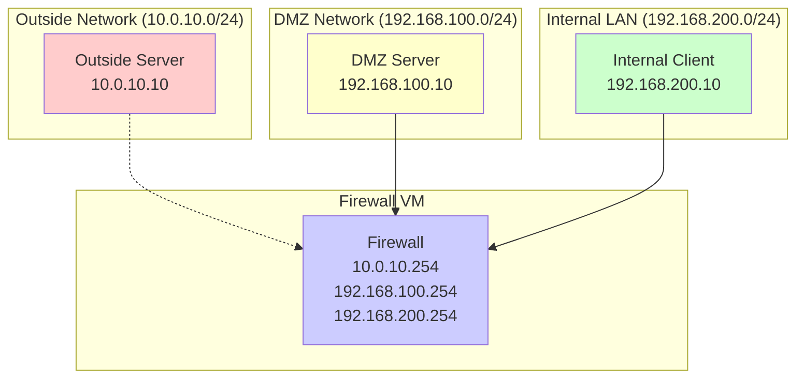
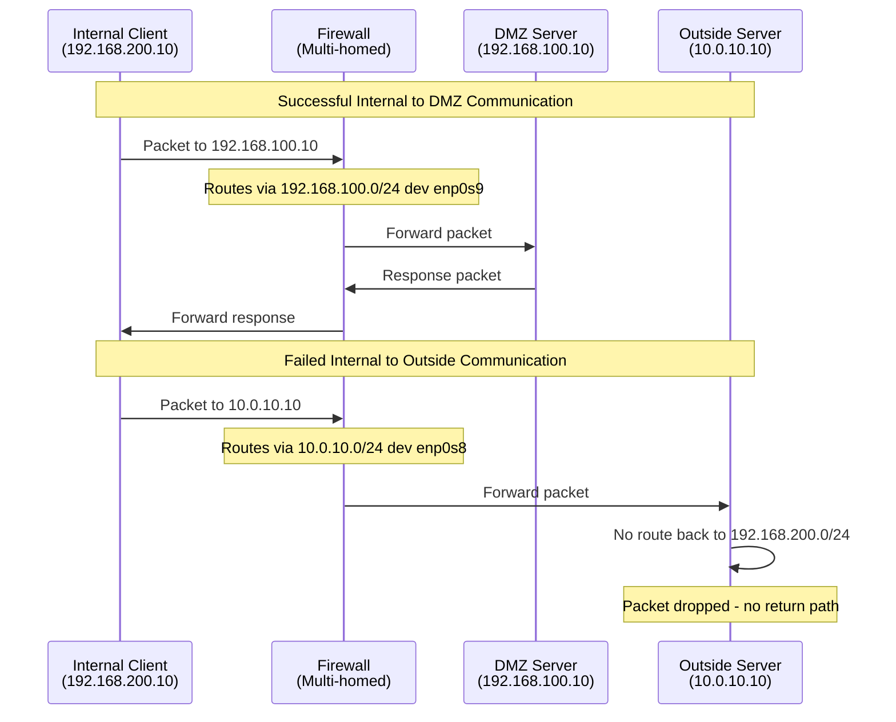

# Chapter 1: Basic Routing

## 🎯 Learning Objectives
- Understand how routing tables work in Linux
- Learn to read and interpret route entries
- Test basic connectivity between network segments
- Understand the role of default gateways

## 📋 Prerequisites
- All VMs should be running (`vagrant up`)
- Basic understanding of IP addressing and subnets

## 🌐 Network Overview



## 🔧 Exercise Steps

### Step 1: Examine Routing Tables

Let's start by understanding how each VM sees the network:

```bash
# SSH into each VM and examine routing tables
vagrant ssh firewall
ip route show
exit

vagrant ssh dmz-server
ip route show
exit

vagrant ssh internal-client
ip route show
exit

vagrant ssh outside-server
ip route show
exit
```

### Step 2: Understanding Route Entries

When you run `ip route show`, you'll see entries like:
```
192.168.100.0/24 dev enp0s9 proto kernel scope link src 192.168.100.254
default via 10.0.2.2 dev enp0s3 proto dhcp src 10.0.2.15 metric 100
```

**Explanation:**
- `192.168.100.0/24 dev enp0s9`: Direct route to DMZ network via interface enp0s9
- `default via 10.0.2.2`: Default route (0.0.0.0/0) through gateway 10.0.2.2
- `proto kernel`: Route added by kernel when interface comes up
- `scope link`: Route is only valid on this link/network segment

### Step 3: Test Basic Connectivity

#### From Internal Client to DMZ Server:
```bash
vagrant ssh internal-client

# Test connectivity using IP
ping -c 3 192.168.100.10

# Test connectivity using hostname
ping -c 3 dmz-server

# Test HTTP service
curl http://dmz-server
```

Why it isn't working? By default, Linux does not route packet between interfaces, a kernel parameter (that can be configured dynamically), sets this behavior: 
```bash
vagrant ssh firewall

cat /proc/sys/net/ipv4/ip_forward
# Will return 0

```
To enable packet forwarding permanently 
```bash
echo 'net.ipv4.ip_forward=1' | sudo tee -a /etc/sysctl.conf
sudo sysctl -p
```

#### From DMZ Server to Internal Client:
```bash
vagrant ssh dmz-server

# Test connectivity
ping -c 3 192.168.200.10
ping -c 3 internal-client
```

### Step 4: Test Connectivity to Outside Network

#### From Internal Client to Outside Server:
```bash
vagrant ssh internal-client

# This should work (routing through firewall)
ping -c 3 10.0.10.10
ping -c 3 outside-server

# Test HTTP service - this might fail due to return routing
curl --connect-timeout 5 http://outside-server
```

#### From Outside Server to Internal Networks:
```bash
vagrant ssh outside-server

# These should fail - no route to private networks
ping -c 3 192.168.100.10
ping -c 3 192.168.200.10
```

## 📊 Routing Flow Diagram



## 🔍 Understanding Why Outside Communication Fails

Currently, communication from internal networks to the outside server fails on the return path. Here's why:

1. **Outbound packet**: Internal client (192.168.200.10) → Firewall → Outside server (10.0.10.10) ✅
2. **Return packet**: Outside server tries to send response to 192.168.200.10 ❌
3. **Problem**: Outside server has no route to 192.168.200.0/24 network

### Check Outside Server Routes:
```bash
vagrant ssh outside-server
ip route show
# You'll see no route to 192.168.100.0/24 or 192.168.200.0/24
```

## 📝 Lab Questions

1. **Why can the internal client communicate with the DMZ server, but not receive responses from the outside server?**

2. **What does the firewall's routing table tell us about which networks it can reach directly?**

3. **If you add a route on the outside server back to the internal networks, would communication work? Try it:**
   ```bash
   vagrant ssh outside-server
   sudo ip route add 192.168.200.0/24 via 10.0.10.254
   sudo ip route add 192.168.100.0/24 via 10.0.10.254
   ```

4. **After adding those routes, test again from internal client:**
   ```bash
   vagrant ssh internal-client
   curl http://outside-server
   ```

## 🎓 Key Takeaways

1. **Routing is bidirectional** - both source and destination need routes to each other
2. **Default gateways** handle traffic to unknown networks
3. **Direct routes** are created automatically when interfaces come up
4. **The firewall acts as a router** between network segments
5. **Private networks need NAT** to communicate with external networks that don't have return routes

## ➡️ Next Steps

In the next chapter, we'll learn how to use iptables FORWARD chain rules to control which traffic can flow between networks, and in Chapter 4, we'll solve the outside communication problem using NAT.

---

**💡 Tip**: Keep track of which communications work and which don't - this will help you understand why NAT is essential in the upcoming exercises!