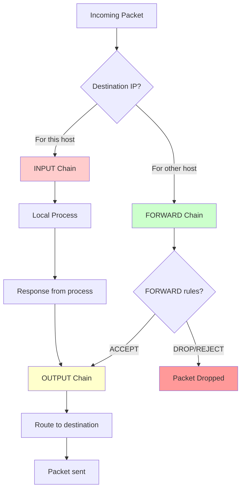
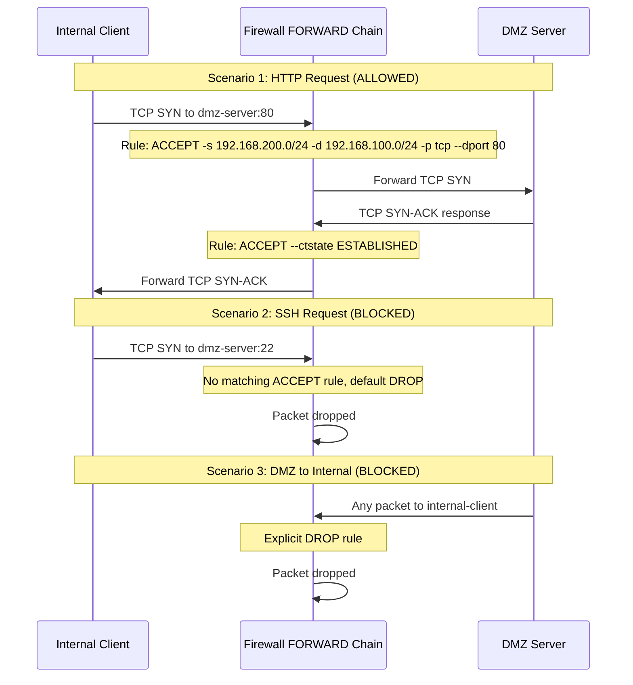
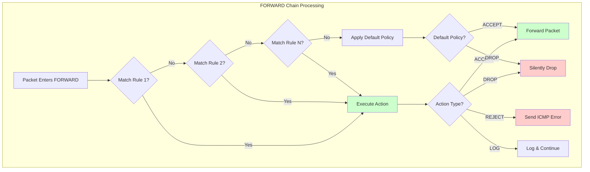

# Chapter 2: IPTables Forwarding Chains

## 🎯 Learning Objectives
- Understand the iptables FORWARD chain and packet traversal
- Learn to control inter-network communication
- Create rules to allow/deny traffic between network segments
- Understand stateful vs stateless filtering

## 📋 Prerequisites
- Completed Chapter 1: Basic Routing
- Understanding of iptables chains concept
- All VMs running with basic connectivity working

## 🔄 IPTables Packet Flow



## 🧪 Understanding the FORWARD Chain

The FORWARD chain processes packets that:
- Enter the firewall on one interface
- Are destined for a different network
- Need to be routed through the firewall

### Current State Check

```bash
vagrant ssh firewall

# Check current iptables rules
sudo iptables -L -v -n

# Check FORWARD chain specifically
sudo iptables -L FORWARD -v -n
```

You should see the default ACCEPT policy we set during provisioning.

## 🔧 Exercise Steps

### Step 1: Ensure Packet Forwarding is enabled


```bash
vagrant ssh firewall

# Enable IP forwarding (should already be enabled)
echo 'net.ipv4.ip_forward=1' | sudo tee -a /etc/sysctl.conf
sudo sysctl -p

# Check forwarding is enabled
cat /proc/sys/net/ipv4/ip_forward
# Should return: 1
```

### Step 2: Monitor FORWARD Chain Activity

Open two terminals to the firewall to monitor traffic:

**Terminal 1 (Monitoring):**
```bash
vagrant ssh firewall

# Watch packet counters in real-time
watch -n 1 'sudo iptables -L FORWARD -v -n'
```

**Terminal 2 (Testing):**
```bash
# Generate some traffic
vagrant ssh internal-client
ping -c 5 dmz-server
```

Observe how packet counters increase in Terminal 1.

### Step 3: Create Restrictive FORWARD Rules

Now let's start controlling traffic between networks:

```bash
vagrant ssh firewall

# First, let's change the default policy to DROP
sudo iptables -P FORWARD DROP

# Test connectivity now - it should fail!
```

Test from another terminal:
```bash
vagrant ssh internal-client
ping -c 3 dmz-server  # This should now fail!
```

### Step 4: Selectively Allow Traffic

Let's create specific rules to control inter-network communication:

#### Allow Internal LAN to DMZ (HTTP only):
```bash
vagrant ssh firewall

# Allow HTTP from Internal to DMZ
sudo iptables -A FORWARD -s 192.168.200.0/24 -d 192.168.100.0/24 -p tcp --dport 80 -j ACCEPT

# Allow return traffic (established connections)
sudo iptables -A FORWARD -s 192.168.100.0/24 -d 192.168.200.0/24 -m conntrack --ctstate ESTABLISHED,RELATED -j ACCEPT
```

Test HTTP access:
```bash
vagrant ssh internal-client

# This should work now
curl http://dmz-server

# But ping should still fail
ping -c 3 dmz-server
```

#### Allow ICMP (ping) between Internal and DMZ:
```bash
vagrant ssh firewall

# Allow ICMP from Internal to DMZ
sudo iptables -A FORWARD -s 192.168.200.0/24 -d 192.168.100.0/24 -p icmp -j ACCEPT

# Allow ICMP responses back
sudo iptables -A FORWARD -s 192.168.100.0/24 -d 192.168.200.0/24 -p icmp -j ACCEPT
```

Test again:
```bash
vagrant ssh internal-client
ping -c 3 dmz-server  # Should work now
```

### Step 5: Block DMZ to Internal Communication

Let's prevent DMZ servers from accessing internal networks:

```bash
vagrant ssh firewall

# Explicitly deny DMZ to Internal (already blocked by default DROP, but let's be explicit)
sudo iptables -A FORWARD -s 192.168.100.0/24 -d 192.168.200.0/24 -j DROP
```

Test this restriction:
```bash
vagrant ssh dmz-server

# This should fail (except for established connections from previous internal->dmz traffic)
ping -c 3 internal-client
```

## 📊 Traffic Flow Scenarios



## 🔍 Advanced FORWARD Chain Rules

### Rule Ordering Matters!

```bash
vagrant ssh firewall

# Check current rule order
sudo iptables -L FORWARD -v -n --line-numbers

# Rules are processed top to bottom - first match wins
# More specific rules should come before general rules
```

### Logging Blocked Traffic

Add logging to see what's being blocked:

```bash
vagrant ssh firewall

# Add logging rule before the final DROP
sudo iptables -I FORWARD -j LOG --log-prefix "FORWARD-DROP: " --log-level 4

# Watch the logs
sudo tail -f /var/log/kern.log | grep "FORWARD-DROP"
```

### Creating Service-Specific Rules

```bash
vagrant ssh firewall

# Allow SSH from Internal to DMZ (insert at beginning)
sudo iptables -I FORWARD 1 -s 192.168.200.0/24 -d 192.168.100.0/24 -p tcp --dport 22 -j ACCEPT

# Allow DNS queries from Internal to Outside (if needed later)
sudo iptables -A FORWARD -s 192.168.200.0/24 -d 10.0.10.0/24 -p udp --dport 53 -j ACCEPT
```

## 🛠️ Practical Exercises

### Exercise A: Create a DMZ Isolation Rule Set

Create rules that:
1. Allow Internal → DMZ (HTTP, HTTPS, SSH)
2. Block DMZ → Internal (all traffic)
3. Allow DMZ → Outside (HTTP, HTTPS for updates)
4. Block Outside → DMZ (will be handled in later chapters with DNAT)

```bash
vagrant ssh firewall

# Clear existing FORWARD rules
sudo iptables -F FORWARD
sudo iptables -P FORWARD DROP

# Internal to DMZ services
sudo iptables -A FORWARD -s 192.168.200.0/24 -d 192.168.100.0/24 -p tcp -m multiport --dports 22,80,443 -j ACCEPT
sudo iptables -A FORWARD -s 192.168.200.0/24 -d 192.168.100.0/24 -p icmp -j ACCEPT

# DMZ to Outside (for updates)
sudo iptables -A FORWARD -s 192.168.100.0/24 -d 10.0.10.0/24 -p tcp -m multiport --dports 80,443 -j ACCEPT

# Allow established/related connections back
sudo iptables -A FORWARD -m conntrack --ctstate ESTABLISHED,RELATED -j ACCEPT

# Log dropped packets
sudo iptables -A FORWARD -j LOG --log-prefix "FORWARD-DROP: "
```

### Exercise B: Test Your Rules

```bash
# Test Internal to DMZ
vagrant ssh internal-client
curl http://dmz-server              # Should work
ssh vagrant@dmz-server "hostname"   # Should work
ping -c 2 dmz-server               # Should work

# Test DMZ to Internal (should fail)
vagrant ssh dmz-server
ping -c 2 internal-client          # Should fail
```

## 📊 Rule Analysis Diagram



## 📝 Lab Questions

1. **What happens if you put a general ACCEPT rule before specific DROP rules?**

2. **Why do we need both outbound and return traffic rules when not using stateful tracking?**

3. **What's the difference between these two approaches:**
   - Separate rules for each direction
   - Using `--ctstate ESTABLISHED,RELATED`

4. **How would you temporarily disable all FORWARD filtering for troubleshooting?**

## 🎓 Key Takeaways

1. **FORWARD chain controls inter-network traffic** through the firewall
2. **Rule order matters** - first match wins
3. **Default policies** should be restrictive (DROP)
4. **Stateful tracking** (`conntrack`) simplifies return traffic handling
5. **Logging** helps troubleshoot blocked connections
6. **Specific rules** should come before general rules

## ➡️ Next Steps

In Chapter 3, we'll explore INPUT and OUTPUT chains to protect the firewall itself, and in Chapter 4, we'll add NAT to enable communication with external networks.

---

**💡 Pro Tip**: Always test your rules incrementally and keep the `iptables -F FORWARD` command handy to clear rules if you lock yourself out!