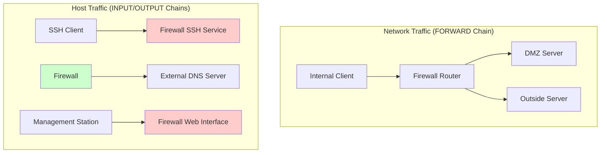
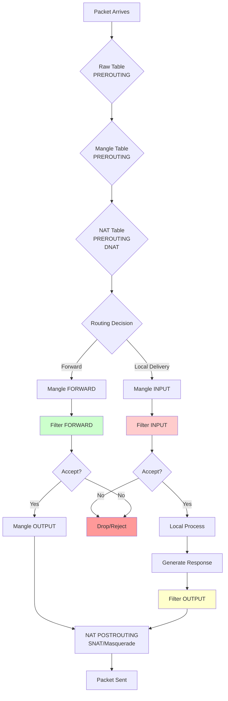
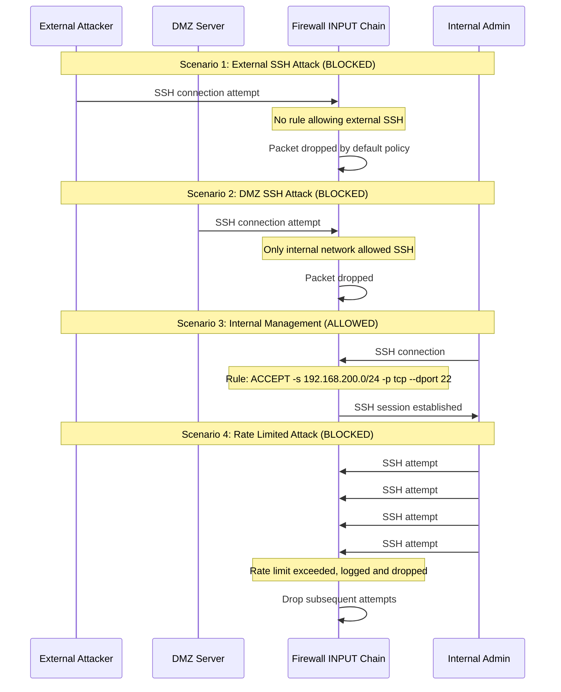
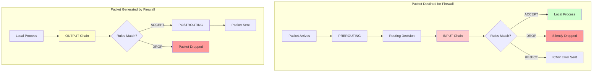

# Chapter 3: Input and Output Filtering

## 🎯 Learning Objectives
- Understand INPUT and OUTPUT chains for host-based protection
- Learn to protect the firewall itself from attacks
- Implement service-specific access controls
- Create management access rules
- Understand the difference between host and network filtering

## 📋 Prerequisites
- Completed Chapters 1-2
- Understanding of iptables chains and packet flow
- Basic knowledge of network services (SSH, HTTP, etc.)

## 🛡️ Host-Based vs Network-Based Filtering



## 🔄 Complete Packet Flow Through IPTables



## 🔧 Exercise Steps

**Note** Interfaces names may vary, so check everytime and don't trust that copying and pasting commands will work out of the box (it's a lab environment! 😊)

### Step 1: Examine Current INPUT/OUTPUT Rules

```bash
vagrant ssh firewall

# Check all chains
sudo iptables -L -v -n

# Specifically check INPUT and OUTPUT
sudo iptables -L INPUT -v -n
sudo iptables -L OUTPUT -v -n

# Check current policies
sudo iptables -L | grep "policy"
```

Currently, all policies should be ACCEPT, which means the firewall itself is unprotected.

### Step 2: Secure the Firewall - INPUT Chain

Let's protect the firewall itself by implementing restrictive INPUT policies:

#### Set Default Policies
```bash
vagrant ssh firewall

# IMPORTANT: Do this in the correct order to avoid locking yourself out!
# First, ensure SSH access is preserved
sudo iptables -A INPUT -p tcp --dport 22 -j ACCEPT
sudo iptables -A INPUT -m conntrack --ctstate ESTABLISHED,RELATED -j ACCEPT
sudo iptables -A INPUT -i lo -j ACCEPT

# Now we can safely set restrictive policies
sudo iptables -P INPUT DROP
sudo iptables -P OUTPUT ACCEPT  # Keep output open for now
```

#### Test SSH Access
Open a new terminal and verify you can still SSH:
```bash
vagrant ssh firewall  # This should still work
```

### Step 3: Create Granular INPUT Rules

Now let's create more specific rules for different types of access:

#### Allow Management from Internal Network Only
```bash
vagrant ssh firewall

# Allow SSH only from internal network
sudo iptables -I INPUT 1 -s 192.168.200.0/24 -p tcp --dport 22 -j ACCEPT

# Remove the general SSH rule (it's now more specific)
sudo iptables -D INPUT -p tcp --dport 22 -j ACCEPT
```

#### Allow ICMP for Network Diagnostics
```bash
vagrant ssh firewall

# Allow ping to firewall from internal networks
sudo iptables -A INPUT -s 192.168.200.0/24 -p icmp --icmp-type echo-request -j ACCEPT
sudo iptables -A INPUT -s 192.168.100.0/24 -p icmp --icmp-type echo-request -j ACCEPT

# Allow ICMP errors and replies
sudo iptables -A INPUT -p icmp --icmp-type echo-reply -j ACCEPT
sudo iptables -A INPUT -p icmp --icmp-type destination-unreachable -j ACCEPT
sudo iptables -A INPUT -p icmp --icmp-type time-exceeded -j ACCEPT
```

#### Test INPUT Rules
```bash
# From internal client - should work
vagrant ssh internal-client
ping -c 3 firewall
ssh vagrant@firewall "hostname"

# From DMZ server - ping should work, SSH should fail
vagrant ssh dmz-server
ping -c 3 firewall-dmz
ssh vagrant@firewall-dmz "hostname"  # Should fail
```

### Step 4: Secure OUTPUT Chain

Now let's control what the firewall itself can access:

```bash
vagrant ssh firewall

# Set restrictive OUTPUT policy
sudo iptables -P OUTPUT DROP

# Allow loopback
sudo iptables -A OUTPUT -o lo -j ACCEPT

# Allow established connections (for SSH sessions, etc.)
sudo iptables -A OUTPUT -m conntrack --ctstate ESTABLISHED,RELATED -j ACCEPT

# Allow DNS queries (needed for hostname resolution)
sudo iptables -A OUTPUT -p udp --dport 53 -j ACCEPT
sudo iptables -A OUTPUT -p tcp --dport 53 -j ACCEPT

# Allow NTP for time synchronization
sudo iptables -A OUTPUT -p udp --dport 123 -j ACCEPT

# Allow HTTP/HTTPS for system updates
sudo iptables -A OUTPUT -p tcp --dport 80 -j ACCEPT
sudo iptables -A OUTPUT -p tcp --dport 443 -j ACCEPT
```

### Step 5: Advanced INPUT Scenarios

#### Rate Limiting SSH Attempts
```bash
vagrant ssh firewall

# Remove existing SSH rule
sudo iptables -D INPUT -s 192.168.200.0/24 -p tcp --dport 22 -j ACCEPT

# Add rate-limited SSH access
sudo iptables -A INPUT -s 192.168.200.0/24 -p tcp --dport 22 -m conntrack --ctstate NEW -m recent --set --name SSH
sudo iptables -A INPUT -s 192.168.200.0/24 -p tcp --dport 22 -m conntrack --ctstate NEW -m recent --update --seconds 60 --hitcount 4 --name SSH -j LOG --log-prefix "SSH-BRUTE: "
sudo iptables -A INPUT -s 192.168.200.0/24 -p tcp --dport 22 -m conntrack --ctstate NEW -m recent --update --seconds 60 --hitcount 4 --name SSH -j DROP
sudo iptables -A INPUT -s 192.168.200.0/24 -p tcp --dport 22 -j ACCEPT
```

#### Create a Management Interface Rule
```bash
vagrant ssh firewall

# Allow web management from internal network only (example for future web interface)
sudo iptables -A INPUT -s 192.168.200.0/24 -p tcp --dport 8080 -j ACCEPT
```

## 📊 Service Protection Scenarios



## 🛠️ Practical Exercises

### Exercise A: Create a Comprehensive Security Policy

Implement a complete INPUT/OUTPUT policy:

```bash
vagrant ssh firewall

# Clear existing rules and start fresh
sudo iptables -F INPUT
sudo iptables -F OUTPUT

# Set up secure INPUT policy
sudo iptables -P INPUT DROP
sudo iptables -P OUTPUT DROP

# Essential services
sudo iptables -A INPUT -i lo -j ACCEPT
sudo iptables -A OUTPUT -o lo -j ACCEPT
sudo iptables -A INPUT -m conntrack --ctstate ESTABLISHED,RELATED -j ACCEPT
sudo iptables -A OUTPUT -m conntrack --ctstate ESTABLISHED,RELATED -j ACCEPT

# Management access (SSH from internal only)
sudo iptables -A INPUT -s 192.168.200.0/24 -p tcp --dport 22 -j ACCEPT

# Network diagnostics
sudo iptables -A INPUT -s 192.168.200.0/24 -p icmp --icmp-type echo-request -j ACCEPT
sudo iptables -A INPUT -s 192.168.100.0/24 -p icmp --icmp-type echo-request -j ACCEPT

# Firewall's outbound needs
sudo iptables -A OUTPUT -p udp --dport 53 -j ACCEPT  # DNS
sudo iptables -A OUTPUT -p udp --dport 123 -j ACCEPT # NTP
sudo iptables -A OUTPUT -p tcp --dport 80 -j ACCEPT  # HTTP
sudo iptables -A OUTPUT -p tcp --dport 443 -j ACCEPT # HTTPS

# Logging for debugging
sudo iptables -A INPUT -j LOG --log-prefix "INPUT-DROP: "
sudo iptables -A OUTPUT -j LOG --log-prefix "OUTPUT-DROP: "
```

### Exercise B: Test Security Policy

```bash
# Test from internal (should work)
vagrant ssh internal-client
ping -c 2 firewall
ssh vagrant@firewall "uptime"

# Test from DMZ (should fail for SSH, work for ping)
vagrant ssh dmz-server
ping -c 2 firewall-dmz
ssh vagrant@firewall-dmz "uptime"  # Should fail

# Monitor logs on firewall
vagrant ssh firewall
sudo tail -f /var/log/kern.log | grep "INPUT-DROP\|OUTPUT-DROP"
```

### Exercise C: Create Service-Specific Rules

Add a web server to the firewall and secure it:

```bash
vagrant ssh firewall

# Install and start a simple web server
sudo apt-get update
sudo apt-get install -y nginx
sudo systemctl start nginx

# Allow HTTP access from internal network only
sudo iptables -I INPUT -s 192.168.200.0/24 -p tcp --dport 80 -j ACCEPT

# Test access
```

From internal client:
```bash
vagrant ssh internal-client
curl http://firewall  # Should work
```

From DMZ (should fail):
```bash
vagrant ssh dmz-server
curl --connect-timeout 5 http://firewall-dmz  # Should timeout/fail
```

## 📊 Chain Interaction Diagram



## 📝 Lab Questions

1. **Why is it important to set up loopback and established connection rules before changing the default policy to DROP?**

2. **What's the difference between protecting the firewall (INPUT/OUTPUT) and protecting the network (FORWARD)?**

3. **How would rate limiting help against brute force attacks?**

4. **What happens if you block OUTPUT traffic but forget to allow DNS? Try it:**
   ```bash
   sudo iptables -D OUTPUT -p udp --dport 53 -j ACCEPT
   nslookup google.com  # What happens?
   ```

5. **Why might you want to allow ICMP errors in the INPUT chain?**

## 🎓 Key Takeaways

1. **INPUT chain protects services on the firewall itself**
2. **OUTPUT chain controls what the firewall can access**
3. **Always preserve management access before changing default policies**
4. **Loopback and established connections are essential**
5. **Rate limiting can prevent brute force attacks**
6. **Service-specific rules provide granular control**
7. **Logging helps with troubleshooting and security monitoring**

## ➡️ Next Steps

In Chapter 4, we'll add NAT functionality to enable private networks to access external services, and in Chapter 5, we'll learn how to expose DMZ services to the outside network.

---

**⚠️ Security Warning**: Always test firewall rules carefully. Keep a console connection open and have a plan to recover if you lock yourself out!