# Chapter 4: NAT and Masquerading

## 🎯 Learning Objectives
- Understand Network Address Translation (NAT) concepts
- Learn the difference between SNAT, DNAT, and MASQUERADE
- Enable internet access for private networks
- Solve the return path problem from Chapter 1
- Understand NAT table and POSTROUTING chain

## 📋 Prerequisites
- Completed Chapters 1-3
- Understanding of the routing problem with private networks
- Knowledge of iptables chains and packet flow

## 🔄 NAT Concepts and Types


## 🔍 Why NAT is Needed

Remember from Chapter 1 - communication failed because:


## 🔧 Exercise Steps

### Step 1: Understand Current State

First, let's verify the problem still exists:

```bash
# Test without NAT (should fail on return path)
vagrant ssh internal-client
curl --connect-timeout 10 http://outside-server
# This should fail or timeout

# Check if we can reach the outside server
ping -c 3 10.0.10.10
# Packets go out but responses may not come back
```

Check the outside server routing:
```bash
vagrant ssh outside-server
ip route show
# Notice: no route to 192.168.200.0/24 or 192.168.100.0/24
```

### Step 2: Implement MASQUERADE for Internet Access

MASQUERADE is perfect for dynamic IP addresses and automatically uses the outgoing interface's IP:

```bash
vagrant ssh firewall

# Enable NAT for internal networks accessing outside
sudo iptables -t nat -A POSTROUTING -s 192.168.200.0/24 -o enp0s8 -j MASQUERADE
sudo iptables -t nat -A POSTROUTING -s 192.168.100.0/24 -o enp0s8 -j MASQUERADE

# Check the NAT rules
sudo iptables -t nat -L -v -n
```

### Step 3: Test NAT Functionality

Now test connectivity with NAT enabled:

```bash
# From internal client
vagrant ssh internal-client
curl http://outside-server
# Should work now!

ping -c 3 outside-server
# Should receive responses

# From DMZ server
vagrant ssh dmz-server
curl http://outside-server
# Should also work
```

### Step 4: Monitor NAT Translations

Let's see NAT in action:

```bash
vagrant ssh firewall

# Install conntrack tools to see active connections
sudo apt-get update
sudo apt-get install -y conntrack

# View active NAT translations
sudo conntrack -L

# Monitor new connections in real-time
sudo conntrack -E
```

In another terminal, generate traffic:
```bash
vagrant ssh internal-client
curl http://outside-server
```

Watch the NAT entries appear and disappear in the conntrack output.

### Step 5: Understanding SNAT vs MASQUERADE

MASQUERADE automatically uses the outgoing interface IP, but SNAT allows you to specify:

```bash
vagrant ssh firewall

# Alternative to MASQUERADE - explicit SNAT
# (Don't run this if MASQUERADE is working - it's just for comparison)

# This would do the same as MASQUERADE:
# sudo iptables -t nat -A POSTROUTING -s 192.168.200.0/24 -o enp0s8 -j SNAT --to-source 10.0.10.254
# sudo iptables -t nat -A POSTROUTING -s 192.168.100.0/24 -o enp0s8 -j SNAT --to-source 10.0.10.254

# MASQUERADE is preferred when the interface IP might change
```

### Step 6: Advanced NAT Scenarios

#### Port-Specific NAT
```bash
vagrant ssh firewall

# NAT only HTTP traffic (example)
sudo iptables -t nat -A POSTROUTING -s 192.168.200.0/24 -p tcp --dport 80 -o enp0s8 -j MASQUERADE

# NAT with port range (for multiple connections)
sudo iptables -t nat -A POSTROUTING -s 192.168.200.0/24 -o enp0s8 -j MASQUERADE --to-ports 32768-65535
```

#### Source-Specific NAT
```bash
vagrant ssh firewall

# Different NAT for different internal subnets (if needed)
sudo iptables -t nat -A POSTROUTING -s 192.168.200.0/24 -d 10.0.10.0/24 -j MASQUERADE
sudo iptables -t nat -A POSTROUTING -s 192.168.100.0/24 -d 10.0.10.0/24 -j MASQUERADE
```

## 📊 NAT Packet Flow Diagram

```mermaid
sequenceDiagram
    participant IC as Internal Client<br/>192.168.200.10:54321
    participant NAT as NAT Table<br/>POSTROUTING
    participant FW as Firewall Interface<br/>10.0.10.254
    participant OS as Outside Server<br/>10.0.10.10:80

    Note over IC,OS: Outbound Connection (SNAT/MASQUERADE)
    IC->>NAT: TCP SYN<br/>src=192.168.200.10:54321<br/>dst=10.0.10.10:80
    Note over NAT: Create translation entry<br/>192.168.200.10:54321 → 10.0.10.254:32768
    NAT->>OS: TCP SYN<br/>src=10.0.10.254:32768<br/>dst=10.0.10.10:80
    
    Note over IC,OS: Return Traffic (Automatic Translation)
    OS->>NAT: TCP SYN-ACK<br/>src=10.0.10.10:80<br/>dst=10.0.10.254:32768
    Note over NAT: Lookup translation entry<br/>10.0.10.254:32768 → 192.168.200.10:54321
    NAT->>IC: TCP SYN-ACK<br/>src=10.0.10.10:80<br/>dst=192.168.200.10:54321
```



## 🛠️ Practical Exercises

### Exercise A: Implement Conditional NAT

Create NAT rules that only apply to specific traffic:

```bash
vagrant ssh firewall

# Clear existing NAT rules
sudo iptables -t nat -F POSTROUTING

# NAT only web traffic from internal to outside
sudo iptables -t nat -A POSTROUTING -s 192.168.200.0/24 -d 10.0.10.0/24 -p tcp --dport 80 -j MASQUERADE
sudo iptables -t nat -A POSTROUTING -s 192.168.200.0/24 -d 10.0.10.0/24 -p tcp --dport 443 -j MASQUERADE

# Test - HTTP should work, but other protocols might not
```

### Exercise B: NAT with Logging

Add logging to see what's being NATted:

```bash
vagrant ssh firewall

# Add logging rule before NAT
sudo iptables -t nat -I POSTROUTING 1 -s 192.168.200.0/24 -j LOG --log-prefix "NAT-OUT: "

# Monitor logs
sudo tail -f /var/log/kern.log | grep "NAT-OUT"

# Generate traffic to see logs
```

### Exercise C: Troubleshoot NAT Issues

```bash
vagrant ssh firewall

# Tools for NAT troubleshooting:

# 1. View NAT rules with packet counters
sudo iptables -t nat -L -v -n

# 2. View connection tracking table
sudo conntrack -L

# 3. Check for connection tracking issues
sudo dmesg | grep conntrack

# 4. Monitor NAT in real-time
sudo tcpdump -i enp0s8 -n host 10.0.10.10
```

### Exercise D: Performance Considerations

```bash
vagrant ssh firewall

# Check connection tracking limits
cat /proc/sys/net/netfilter/nf_conntrack_max
cat /proc/sys/net/netfilter/nf_conntrack_count

# Monitor connection tracking performance
watch -n 1 'cat /proc/sys/net/netfilter/nf_conntrack_count'

# Generate multiple concurrent connections
vagrant ssh internal-client
for i in {1..10}; do curl http://outside-server & done
```

## 📊 NAT Table Processing Order


## 📝 Lab Questions

1. **What's the difference between SNAT and MASQUERADE? When would you use each?**

2. **Why does NAT happen in POSTROUTING chain instead of FORWARD?**

3. **What happens to the connection tracking table when connections close?**

4. **How would you NAT traffic from internal networks to different external IPs?**

5. **Test what happens if you remove NAT rules while connections are active:**
   ```bash
   # Start a long-running connection
   vagrant ssh internal-client
   curl -s http://outside-server/large-file &
   
   # Remove NAT rules on firewall
   vagrant ssh firewall
   sudo iptables -t nat -F POSTROUTING
   
   # What happens to the existing connection?
   ```

## 🎓 Key Takeaways

1. **NAT solves the return path problem** for private networks
2. **MASQUERADE is ideal for dynamic interfaces**
3. **SNAT gives more control but requires static IPs**
4. **NAT happens in POSTROUTING after routing decisions**
5. **Connection tracking automatically handles return traffic**
6. **NAT can be conditional** based on protocols, ports, destinations
7. **Monitor connection tracking** for performance and troubleshooting

## ➡️ Next Steps

In Chapter 5, we'll learn about Destination NAT (DNAT) to expose internal services to external networks, and in Chapter 6, we'll handle the special case of hairpin NAT.

---

**💡 Pro Tip**: Always monitor connection tracking table size in production environments - high connection volumes can exhaust the tracking table!