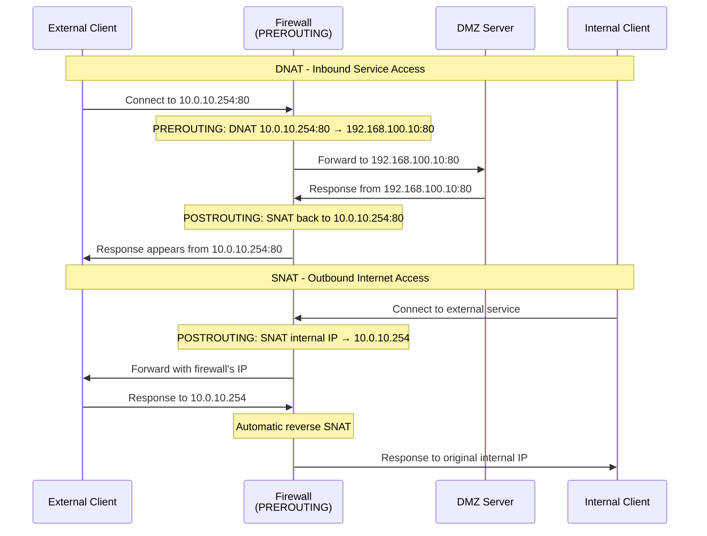
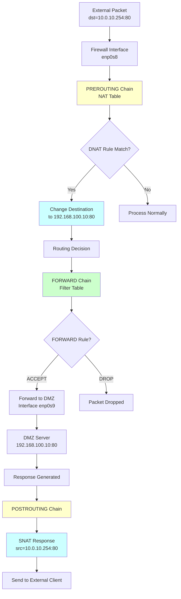
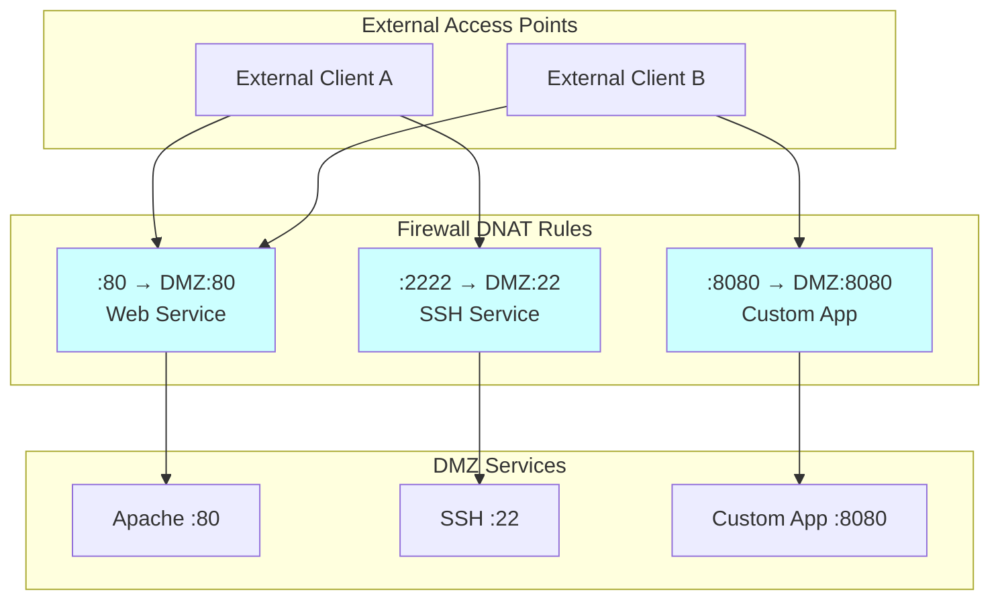

# Chapter 5: Exposing DMZ Services (DNAT)

## 🎯 Learning Objectives
- Understand Destination NAT (DNAT) for service publishing
- Learn port forwarding and service exposure techniques
- Implement secure DMZ service access from external networks
- Understand PREROUTING chain and early packet processing
- Handle multiple services and port mapping

## 📋 Prerequisites
- Completed Chapters 1-4
- Understanding of SNAT/MASQUERADE from Chapter 4
- Knowledge of service ports and protocols
- DMZ server running with web and SSH services

## 🌐 DNAT Concept Overview

```mermaid
graph TB
    subgraph "External Network"
        EXT[External Client<br/>Internet User]
    end
    
    subgraph "Outside Network (10.0.10.0/24)"
        OS[Outside Server<br/>10.0.10.10<br/>(Simulates Internet)]
    end
    
    subgraph "Firewall"
        FW[Firewall<br/>10.0.10.254<br/>DNAT Rules]
    end
    
    subgraph "DMZ (192.168.100.0/24)"
        WEB[Web Server<br/>192.168.100.10:80]
        SSH[SSH Service<br/>192.168.100.10:22]
    end
    
    EXT --> OS
    OS -.->|"Connects to 10.0.10.254:80"| FW
    FW -->|"DNAT to 192.168.100.10:80"| WEB
    OS -.->|"Connects to 10.0.10.254:2222"| FW
    FW -->|"DNAT to 192.168.100.10:22"| SSH
    
    style FW fill:#ccffff
    style WEB fill:#ccffcc
    style SSH fill:#ccffcc
```

## 🔄 DNAT vs SNAT Processing



## 🔧 Exercise Steps

### Step 1: Verify Current DMZ Service Status

First, let's confirm what services are running in the DMZ:

```bash
vagrant ssh dmz-server

# Check running services
sudo netstat -tlnp | grep -E ":(22|80)"
sudo systemctl status apache2
sudo systemctl status ssh

# Verify web service works locally
curl localhost
```

### Step 2: Test Current External Access (Should Fail)

```bash
# From outside server, try to access DMZ services directly
vagrant ssh outside-server

# These should fail - no route to DMZ network
curl --connect-timeout 5 http://192.168.100.10
ssh -o ConnectTimeout=5 vagrant@192.168.100.10 "hostname"

# Try accessing firewall's outside interface (should also fail - no service)
curl --connect-timeout 5 http://10.0.10.254
```

### Step 3: Implement Basic DNAT Rules

Now let's expose DMZ services through DNAT:

```bash
vagrant ssh firewall

# Expose DMZ web server through firewall's outside interface
sudo iptables -t nat -A PREROUTING -i eth1 -p tcp --dport 80 -j DNAT --to-destination 192.168.100.10:80

# Allow the forwarded traffic through FORWARD chain
sudo iptables -A FORWARD -i eth1 -o eth2 -p tcp --dport 80 -d 192.168.100.10 -j ACCEPT

# View the new rules
sudo iptables -t nat -L PREROUTING -v -n
sudo iptables -L FORWARD -v -n
```

### Step 4: Test Web Service Exposure

```bash
# From outside server, test access to exposed web service
vagrant ssh outside-server

# This should now work!
curl http://10.0.10.254

# Check what the DMZ server sees in its logs
```

Check DMZ server logs:
```bash
vagrant ssh dmz-server
sudo tail -f /var/log/apache2/access.log
# You should see requests coming from 10.0.10.254 (the firewall's IP due to SNAT)
```

### Step 5: Expose SSH with Port Mapping

For security, let's expose SSH on a non-standard port:

```bash
vagrant ssh firewall

# Expose SSH on port 2222, mapping to DMZ server's port 22
sudo iptables -t nat -A PREROUTING -i eth1 -p tcp --dport 2222 -j DNAT --to-destination 192.168.100.10:22

# Allow the SSH traffic through FORWARD chain
sudo iptables -A FORWARD -i eth1 -o eth2 -p tcp --dport 22 -d 192.168.100.10 -j ACCEPT
```

### Step 6: Test SSH Port Forwarding

```bash
# From outside server, test SSH access
vagrant ssh outside-server

# Connect to SSH through the firewall (password: vagrant)
ssh -p 2222 vagrant@10.0.10.254

# Once connected, verify you're on the DMZ server
hostname
ip addr show
```

## 📊 Complete DNAT Packet Flow



## 🛠️ Advanced DNAT Scenarios

### Exercise A: Multiple Service Exposure

Expose multiple services with different configurations:

```bash
vagrant ssh firewall

# Expose HTTPS (if available) on standard port
sudo iptables -t nat -A PREROUTING -i enp0s8 -p tcp --dport 443 -j DNAT --to-destination 192.168.100.10:443
sudo iptables -A FORWARD -i enp0s8 -o enp0s9 -p tcp --dport 443 -d 192.168.100.10 -j ACCEPT

# Expose a custom application on high port
# (Assuming DMZ server has a service on port 8080)
sudo iptables -t nat -A PREROUTING -i enp0s8 -p tcp --dport 8080 -j DNAT --to-destination 192.168.100.10:8080
sudo iptables -A FORWARD -i enp0s8 -o enp0s9 -p tcp --dport 8080 -d 192.168.100.10 -j ACCEPT
```

### Exercise B: Source-Based DNAT

Create rules that only apply to specific external sources:

```bash
vagrant ssh firewall

# Only allow SSH from the outside server (more restrictive)
sudo iptables -t nat -R PREROUTING 2 -i enp0s8 -s 10.0.10.10 -p tcp --dport 2222 -j DNAT --to-destination 192.168.100.10:22

# Update corresponding FORWARD rule
sudo iptables -R FORWARD 2 -i enp0s8 -s 10.0.10.10 -o enp0s9 -p tcp --dport 22 -d 192.168.100.10 -j ACCEPT
```

### Exercise C: Load Balancing with DNAT

Simulate load balancing between multiple DMZ servers (conceptual):

```bash
vagrant ssh firewall

# Example of round-robin DNAT (would need multiple DMZ servers)
# sudo iptables -t nat -A PREROUTING -i enp0s8 -p tcp --dport 80 -m statistic --mode nth --every 2 --packet 0 -j DNAT --to-destination 192.168.100.10:80
# sudo iptables -t nat -A PREROUTING -i enp0s8 -p tcp --dport 80 -m statistic --mode nth --every 2 --packet 1 -j DNAT --to-destination 192.168.100.11:80
```

## 📊 Service Exposure Architecture



## 🔍 Troubleshooting DNAT Issues

### Common Problems and Solutions

#### 1. DNAT Rule Not Working
```bash
vagrant ssh firewall

# Check if rule exists and has matches
sudo iptables -t nat -L PREROUTING -v -n --line-numbers

# Check FORWARD chain allows the traffic
sudo iptables -L FORWARD -v -n --line-numbers

# Verify interface names
ip link show
```

#### 2. Service Not Responding
```bash
# Check if service is actually listening on DMZ server
vagrant ssh dmz-server
sudo netstat -tlnp

# Test local connectivity on DMZ server
curl localhost:80
```

#### 3. Monitor DNAT in Action
```bash
vagrant ssh firewall

# Monitor NAT table activity
sudo conntrack -L | grep 192.168.100.10

# Watch packets being NATted
sudo tcpdump -i enp0s8 -n port 80
sudo tcpdump -i enp0s9 -n port 80

# Monitor both interfaces simultaneously
```

## 📝 Security Considerations

### Secure DNAT Implementation

```bash
vagrant ssh firewall

# Limit connections per source IP
sudo iptables -A FORWARD -i enp0s8 -p tcp --dport 80 -m connlimit --connlimit-above 10 -j DROP

# Rate limit new connections
sudo iptables -A FORWARD -i enp0s8 -p tcp --dport 80 -m recent --set --name web_limit
sudo iptables -A FORWARD -i enp0s8 -p tcp --dport 80 -m recent --update --seconds 60 --hitcount 20 --name web_limit -j DROP

# Log suspicious activity
sudo iptables -A FORWARD -i enp0s8 -p tcp --dport 22 -m recent --set --name ssh_attempts
sudo iptables -A FORWARD -i enp0s8 -p tcp --dport 22 -m recent --update --seconds 60 --hitcount 5 --name ssh_attempts -j LOG --log-prefix "SSH-ATTACK: "
```

## 📝 Lab Questions

1. **Why do we need both DNAT (in PREROUTING) and FORWARD rules for service exposure to work?**

2. **What happens if you forget to add the corresponding FORWARD rule after creating a DNAT rule?**

3. **How does the DMZ server see the source IP of incoming connections? Why?**

4. **Test the effect of rule order in PREROUTING:**
   ```bash
   # Add a conflicting rule and see what happens
   sudo iptables -t nat -I PREROUTING 1 -i enp0s8 -p tcp --dport 80 -j DROP
   ```

5. **What's the difference between exposing a service on the same port vs. a different port?**

## 🎓 Key Takeaways

1. **DNAT happens in PREROUTING** before routing decisions
2. **FORWARD rules are still required** for NATted traffic
3. **Port mapping allows security through obscurity**
4. **Source-based rules provide granular access control**
5. **Connection tracking handles return traffic automatically**
6. **Monitor both NAT and filter tables** for troubleshooting
7. **Security measures should always accompany service exposure**

## ➡️ Next Steps

In Chapter 6, we'll tackle hairpin NAT - the special case where internal clients need to access published services using the external IP address.

---

**🔒 Security Tip**: Always implement rate limiting and connection limits when exposing services to prevent abuse and DoS attacks!