# Chapter 6: Hairpin NAT

## 🎯 Learning Objectives
- Understand the hairpin NAT problem and why it occurs
- Learn to enable internal clients to access published services via external IP
- Implement NAT loopback for seamless internal/external service access
- Understand the complexities of bidirectional NAT
- Solve split-brain DNS scenarios with NAT

## 📋 Prerequisites
- Completed Chapters 1-5
- DNAT rules from Chapter 5 should be working
- Understanding of both SNAT and DNAT concepts
- Knowledge of how internal and external traffic flows differ

## 🤔 The Hairpin NAT Problem


## 🔍 Why Hairpin NAT Fails Without Special Rules

The problem occurs because:

1. **Internal client** connects to `10.0.10.254:80`
2. **DNAT rule** changes destination to `192.168.100.10:80`
3. **Source IP remains unchanged** (`192.168.200.10`)
4. **DMZ server** responds directly to `192.168.200.10` (bypassing firewall)
5. **Client receives response** from `192.168.100.10:80` instead of expected `10.0.10.254:80`
6. **Connection breaks** due to IP/port mismatch

## 🔧 Exercise Steps

### Step 1: Reproduce the Hairpin NAT Problem

First, let's demonstrate the issue:

```bash
# Ensure DNAT rules from Chapter 5 are active
vagrant ssh firewall
sudo iptables -t nat -L PREROUTING -v -n

# From internal client, try to access DMZ service via external IP
vagrant ssh internal-client

# This should fail or behave unexpectedly
curl --connect-timeout 10 http://10.0.10.254

# But direct access should work fine
curl http://dmz-server
curl http://192.168.100.10
```

### Step 2: Monitor the Traffic Flow

Let's see what's actually happening:

```bash
# On firewall, monitor traffic on both interfaces
vagrant ssh firewall

# Terminal 1: Monitor internal interface
sudo tcpdump -i enp0s10 -n host 192.168.200.10

# Terminal 2: Monitor DMZ interface  
sudo tcpdump -i enp0s9 -n host 192.168.100.10

# Terminal 3: Generate traffic
vagrant ssh internal-client
curl -v http://10.0.10.254
```

You'll see the request going out but the response taking a different path.

### Step 3: Implement Hairpin NAT Solution

The solution requires **both** DNAT and SNAT for internal traffic accessing external IPs:

```bash
vagrant ssh firewall

# Hairpin NAT rule: For internal clients accessing external IP of DMZ services
# This rule must be more specific than general DNAT rules, so we insert it first

# DNAT: Change destination from external IP to internal service
sudo iptables -t nat -I PREROUTING 1 -s 192.168.200.0/24 -d 10.0.10.254 -p tcp --dport 80 -j DNAT --to-destination 192.168.100.10:80

# SNAT: Change source to firewall's IP so response comes back through firewall
sudo iptables -t nat -A POSTROUTING -s 192.168.200.0/24 -d 192.168.100.10 -p tcp --dport 80 -j SNAT --to-source 192.168.100.254

# Verify the rules are in correct order
sudo iptables -t nat -L PREROUTING -v -n --line-numbers
sudo iptables -t nat -L POSTROUTING -v -n --line-numbers
```

### Step 4: Test Hairpin NAT Solution

```bash
# From internal client, test access via external IP
vagrant ssh internal-client

# This should now work!
curl http://10.0.10.254
curl -v http://10.0.10.254

# Verify it still works directly
curl http://dmz-server
```

### Step 5: Extend Hairpin NAT to SSH

Apply the same principle to SSH service:

```bash
vagrant ssh firewall

# Hairpin NAT for SSH (port 2222 → 22)
sudo iptables -t nat -I PREROUTING 2 -s 192.168.200.0/24 -d 10.0.10.254 -p tcp --dport 2222 -j DNAT --to-destination 192.168.100.10:22
sudo iptables -t nat -A POSTROUTING -s 192.168.200.0/24 -d 192.168.100.10 -p tcp --dport 22 -j SNAT --to-source 192.168.100.254

# Test SSH hairpin NAT
vagrant ssh internal-client
ssh -p 2222 vagrant@10.0.10.254 "hostname"
```

## 📊 Complete Hairpin NAT Flow

```mermaid
sequenceDiagram
    participant IC as Internal Client<br/>(192.168.200.10)
    participant FW as Firewall NAT
    participant DMZ as DMZ Server<br/>(192.168.100.10)

    Note over IC,DMZ: Working Hairpin NAT with DNAT + SNAT
    IC->>FW: HTTP to 10.0.10.254:80<br/>src=192.168.200.10
    
    Note over FW: PREROUTING DNAT<br/>dst: 10.0.10.254:80 → 192.168.100.10:80
    Note over FW: POSTROUTING SNAT<br/>src: 192.168.200.10 → 192.168.100.254
    
    FW->>DMZ: HTTP to 192.168.100.10:80<br/>src=192.168.100.254
    DMZ->>FW: Response to 192.168.100.254<br/>src=192.168.100.10:80
    
    Note over FW: Reverse SNAT<br/>dst: 192.168.100.254 → 192.168.200.10
    Note over FW: Reverse DNAT<br/>src: 192.168.100.10:80 → 10.0.10.254:80
    
    FW->>IC: Response from 10.0.10.254:80<br/>dst=192.168.200.10
    
    Note over IC: Client receives expected response!
```



## 🛠️ Advanced Hairpin NAT Scenarios

### Exercise A: Multiple Internal Networks

Extend hairpin NAT to work from DMZ to DMZ services:

```bash
vagrant ssh firewall

# Allow DMZ servers to access published services via external IP
sudo iptables -t nat -I PREROUTING 3 -s 192.168.100.0/24 -d 10.0.10.254 -p tcp --dport 80 -j DNAT --to-destination 192.168.100.10:80
sudo iptables -t nat -A POSTROUTING -s 192.168.100.0/24 -d 192.168.100.10 -p tcp --dport 80 -j SNAT --to-source 192.168.100.254

# Test from DMZ server
vagrant ssh dmz-server
curl http://10.0.10.254  # Should work now
```

### Exercise B: Conditional Hairpin NAT

Create hairpin NAT rules that only apply during certain conditions:

```bash
vagrant ssh firewall

# Time-based hairpin NAT (business hours only)
sudo iptables -t nat -I PREROUTING 1 -s 192.168.200.0/24 -d 10.0.10.254 -p tcp --dport 80 -m time --timestart 09:00 --timestop 17:00 -j DNAT --to-destination 192.168.100.10:80

# User-based hairpin NAT (specific source IPs)
sudo iptables -t nat -I PREROUTING 1 -s 192.168.200.10 -d 10.0.10.254 -p tcp --dport 80 -j DNAT --to-destination 192.168.100.10:80
```

### Exercise C: Hairpin NAT with Load Balancing

Implement hairpin NAT with simple load balancing:

```bash
vagrant ssh firewall

# Round-robin hairpin NAT (conceptual - would need multiple servers)
# sudo iptables -t nat -A PREROUTING -s 192.168.200.0/24 -d 10.0.10.254 -p tcp --dport 80 -m statistic --mode nth --every 2 --packet 0 -j DNAT --to-destination 192.168.100.10:80
# sudo iptables -t nat -A PREROUTING -s 192.168.200.0/24 -d 10.0.10.254 -p tcp --dport 80 -m statistic --mode nth --every 2 --packet 1 -j DNAT --to-destination 192.168.100.11:80
```

## 📊 Hairpin NAT Rule Interaction


## 🔍 Troubleshooting Hairpin NAT

### Common Issues and Diagnostics

#### 1. Rule Order Problems
```bash
vagrant ssh firewall

# Check rule order - more specific rules must come first
sudo iptables -t nat -L PREROUTING -v -n --line-numbers

# If order is wrong, remove and re-add rules in correct order
# sudo iptables -t nat -D PREROUTING <line_number>
```

#### 2. Missing SNAT Rules
```bash
# Verify both DNAT and SNAT rules exist
sudo iptables -t nat -L POSTROUTING -v -n | grep -E "192\.168\.100\.(10|254)"

# Check connection tracking
sudo conntrack -L | grep 192.168.100.10
```

#### 3. Monitoring Hairpin Traffic
```bash
vagrant ssh firewall

# Monitor hairpin NAT connections specifically
watch -n 2 'sudo conntrack -L | grep -E "192\.168\.200\.10.*192\.168\.100\.10"'

# Log hairpin NAT rule hits
sudo iptables -t nat -I PREROUTING 1 -s 192.168.200.0/24 -d 10.0.10.254 -j LOG --log-prefix "HAIRPIN-DNAT: "
sudo iptables -t nat -I POSTROUTING 1 -s 192.168.200.0/24 -d 192.168.100.10 -j LOG --log-prefix "HAIRPIN-SNAT: "
```

## 📝 Real-World Scenarios

### Split-Brain DNS Alternative

Hairpin NAT can eliminate the need for split-brain DNS:


### Service Discovery Scenarios

```bash
# Example: Internal services that need to discover published services
vagrant ssh internal-client

# Application can use the same external URL/IP regardless of location
# curl http://api.company.com  (resolves to 10.0.10.254)
# Hairpin NAT makes this work from internal network
```

## 📝 Lab Questions

1. **Why does hairpin NAT require both DNAT and SNAT rules?**

2. **What would happen if you only implemented the DNAT part of hairpin NAT?**

3. **How does rule order affect hairpin NAT functionality?**

4. **Test the impact of removing the SNAT rule:**
   ```bash
   sudo iptables -t nat -D POSTROUTING -s 192.168.200.0/24 -d 192.168.100.10 -p tcp --dport 80 -j SNAT --to-source 192.168.100.254
   # What happens to internal access?
   ```

5. **How would you troubleshoot a situation where external access works but internal access doesn't?**

## 🎓 Key Takeaways

1. **Hairpin NAT solves internal access to published services**
2. **Requires both DNAT and SNAT** for proper bidirectional translation
3. **Rule order is critical** - specific rules before general ones
4. **Eliminates need for split-brain DNS** configurations
5. **Source NAT prevents response bypassing** the firewall
6. **Connection tracking handles** reverse translations automatically
7. **Essential for seamless internal/external service access**

## 🏆 Congratulations!

You've completed the comprehensive iptables networking lab series! You now understand:

- ✅ Basic routing and network connectivity
- ✅ FORWARD chain traffic control  
- ✅ INPUT/OUTPUT host protection
- ✅ SNAT/MASQUERADE for outbound access
- ✅ DNAT for service publishing
- ✅ Hairpin NAT for seamless access

## ➡️ Next Steps for Further Learning

1. **Explore advanced iptables modules** (geoip, string matching, etc.)
2. **Study nftables** as the modern replacement for iptables
3. **Learn about container networking** with Docker/Kubernetes
4. **Investigate modern firewalls** like pfSense, OPNsense
5. **Practice with real-world scenarios** and production environments

---

**🎉 Well Done**: You now have the skills to design, implement, and troubleshoot complex network security scenarios with iptables!