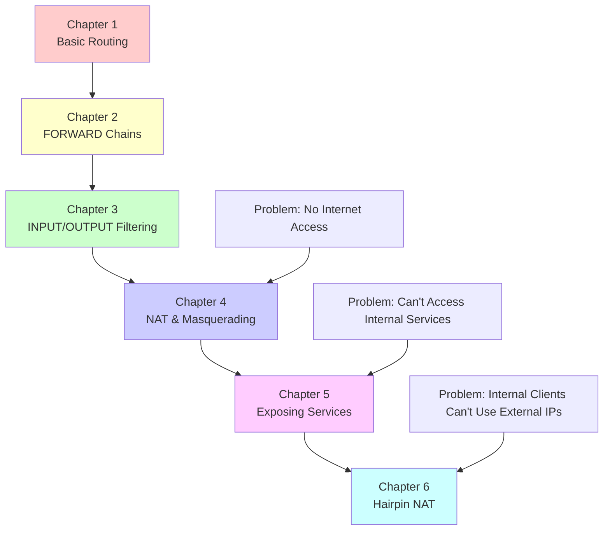
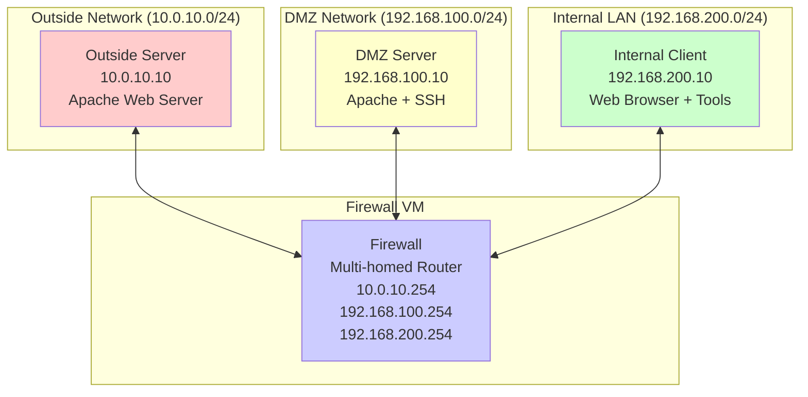

# IPTables Learning Lab - Exercise Index

This directory contains a comprehensive series of hands-on exercises for learning Linux networking and iptables firewall configuration. Each chapter builds upon the previous ones, creating a complete learning path from basic routing to advanced NAT scenarios.

## 📚 Exercise Structure

Each exercise includes:
- 🎯 **Learning Objectives** - Clear goals for the chapter
- 📋 **Prerequisites** - What you need to know/complete first  
- 🔧 **Step-by-Step Instructions** - Hands-on commands and configurations
- 📊 **Mermaid Diagrams** - Visual representations of network flows and packet processing
- 🛠️ **Practical Exercises** - Additional scenarios to practice
- 📝 **Lab Questions** - Test your understanding
- 🎓 **Key Takeaways** - Summary of important concepts

## 🗂️ Chapter Overview

### [Chapter 1: Basic Routing](./1-basic-routing.md)
**Foundation concepts for network communication**
- Understanding routing tables and default gateways
- Testing connectivity between network segments
- Identifying why private networks can't communicate with external hosts
- **Key Concept**: The return path problem that NAT solves

### [Chapter 2: IPTables Forwarding Chains](./2-iptables-forwarding.md) 
**Controlling inter-network traffic flow**
- Understanding packet traversal through the FORWARD chain
- Creating rules to allow/deny traffic between network segments
- Implementing stateful connection tracking
- **Key Concept**: Firewall as a network traffic controller

### [Chapter 3: Input and Output Filtering](./3-input-output-filtering.md)
**Protecting the firewall host itself**
- Securing services running on the firewall
- Creating management access policies
- Implementing rate limiting and attack prevention
- **Key Concept**: Host-based vs network-based security

### [Chapter 4: NAT and Masquerading](./4-nat-masquerading.md)
**Enabling internet access for private networks**
- Understanding Source NAT (SNAT) and MASQUERADE
- Solving the return path routing problem from Chapter 1
- Implementing outbound internet access for internal networks
- **Key Concept**: How NAT enables private networks to access the internet

### [Chapter 5: Exposing DMZ Services](./5-exposing-dmz-services.md)
**Publishing internal services to external networks** 
- Understanding Destination NAT (DNAT) and port forwarding
- Exposing web servers and SSH services securely
- Implementing service-specific access controls
- **Key Concept**: Making internal services accessible from the internet

### [Chapter 6: Hairpin NAT](./6-hairpin-nat.md)
**Advanced NAT for internal access to published services**
- Solving the hairpin NAT problem for internal clients
- Implementing bidirectional NAT (DNAT + SNAT)
- Eliminating the need for split-brain DNS
- **Key Concept**: Seamless service access regardless of client location

## 🎯 Learning Path



## 🚀 Getting Started

### Prerequisites
- Vagrant and VirtualBox installed
- Basic Linux command line knowledge
- Understanding of IP addressing and subnets
- All VMs running (`vagrant up` from the main directory)

### Recommended Approach

1. **Read each chapter completely** before starting the exercises
2. **Follow exercises in order** - each builds on previous knowledge
3. **Experiment with variations** - try the suggested modifications
4. **Answer the lab questions** to test your understanding
5. **Keep notes** of what works and what doesn't

### Lab Environment

The exercises use this network topology:



## 🛠️ Quick Commands Reference

### Essential IPTables Commands
```bash
# View all rules
sudo iptables -L -v -n

# View NAT rules  
sudo iptables -t nat -L -v -n

# Clear all rules (DANGER!)
sudo iptables -F
sudo iptables -t nat -F

# Save rules (Ubuntu/Debian)
sudo netfilter-persistent save

# Monitor connection tracking
sudo conntrack -L
```

### Vagrant Commands
```bash
# Start all VMs
vagrant up

# SSH to specific VM
vagrant ssh firewall
vagrant ssh dmz-server  
vagrant ssh internal-client
vagrant ssh outside-server

# Restart specific VM
vagrant reload firewall

# Stop all VMs
vagrant halt
```

### Network Troubleshooting
```bash
# Test connectivity
ping <hostname>
curl http://<hostname>
telnet <hostname> <port>

# Monitor traffic  
sudo tcpdump -i <interface> -n
sudo netstat -tlnp
ss -tuln

# Check routing
ip route show
ip addr show
```

## 🎓 Learning Outcomes

After completing all exercises, you will:

✅ **Understand Linux routing** and how packets flow between networks  
✅ **Master iptables chains** (INPUT, OUTPUT, FORWARD, PREROUTING, POSTROUTING)  
✅ **Configure network security policies** for different network segments  
✅ **Implement NAT solutions** for both inbound and outbound traffic  
✅ **Troubleshoot connectivity issues** using standard Linux tools  
✅ **Design secure network architectures** with proper segmentation  
✅ **Handle complex NAT scenarios** including hairpin NAT

## 📖 Additional Resources

- [Netfilter/IPTables Documentation](https://www.netfilter.org/documentation/)
- [Linux Advanced Routing & Traffic Control](https://lartc.org/)
- [IPTables Tutorial by Oskar Andreasson](https://www.frozentux.net/iptables-tutorial/)
- [Ubuntu IPTables HowTo](https://help.ubuntu.com/community/IptablesHowTo)

## 🤝 Contributing

If you find errors, have suggestions, or want to add more exercises:
1. Document the issue or enhancement clearly
2. Test your changes in the lab environment
3. Ensure all existing exercises still work
4. Update this index if needed

---

**🎉 Happy Learning!** Take your time with each concept and don't hesitate to experiment beyond the provided exercises. The best way to learn networking is through hands-on practice!